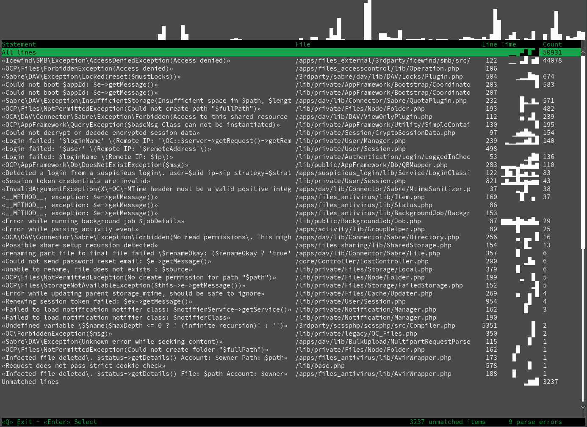

# logsmash

Analysis tool for Nextcloud logs files



## Quickstart

Download the binary from the [releases page](https://github.com/icewind1991/logsmash/releases), place it somewhere in
your `$PATH` and make it executable.

```bash
logsmash ./logfile.log
```

## Log files

Logsmash supports both loading plain log files, or zip files containing (only) the log.

## Log sources

Logsmash is built around matching log line to their source, either a call to a logging function or an exception being
thrown.
Many log lines do not include information about their source to logsmash attempts to find the source of the log by
comparing
the logged message against a list of known log sources included in the binary.

Since multiple log sources can create similar log lines, some lines will match to multiple log sources, in those cases
logsmash
will show all the matched sources as a single item.
Log items that cannot be matched to any known source are grouped together

## UI overview

Logsmash contains the following UI pages:

### Overview

Shows a list of all matched sources with their source location, the number of log items matched to the source, and a
graph of log occurrence over time.

Selecting an item will bring you to the source overview for the log source.

### Source overview

Shows a list of distinct log lines (lines with the same message, level and context).

Selecting an item will bring you to the log list

### Log list

Shows a list of individual log items

Selecting an item will bring you to the log page

### Log page

Shows the message and accompanying metadata for the log line. For log lines with exceptions, the exception backtrace is
shown.

### Log occurrence graph

Lists that contain grouped log lines come with a graph that show how often the group of log lines occurred over time as
a histogram.
Each line in the list will show a small version of the graph, and a larger version of the graph for the selected item is
shown above the list.

## Keyboard controls

- All lists are navigated with the arrow keys, `PgUp`/`PgDown` and `Home`/`End`.
- Items in lists can be selected with `Enter` or the right arrow key.
- You can return to the previous page with `Esc` or the left arrow key.
- Single log items can be copied as json with `c` (requires [OSC 52 support](https://github.com/ojroques/vim-oscyank))

## Supported data

Currently, the program can match against data from the following sources:

- Nextcloud server 24 - 29
- files_accesscontrol 1.19.1
- files_antivirus 5.5.7
- deck: 1.13.1
- calendar: 4.7.13
- contacts: 5.5.3, 6.0.0
- groupfolders: 16.0.7, 17.0.1
- guests: 3.1.0, 4.0.0
- spreed: 18.0.10, 19.0.7
- form: 4.2.4
- tasks: 0.16.0
- notes: 4.10.1
- richdocuments: 8.4.3
- collectives: 2.13.0
- onlyoffice: 9.3.0
- tables: 0.7.4
- mail: 3.7.5
- files_accesscontrol: 1.19.1
- files_accesscontrol: 1.20.0
- files_retention: 1.18.0

## Roadmap

- [ ] More flexible log file input
  - [x] Log files compressed trough gzip
  - [ ] Log files compressed trough other compression methods
  - [ ] Archived containing more than one file
- [ ] Data from more app version
- [ ] Support extracting app versions from a system report
- [ ] Add filtering to all lists

## Building

The preferred way of building is trough [`nix`](https://nixos.org/download/#download-nix), this ensures that all baked
data is automatically up-to-date.

`nix build .#logsmash`

#### Updating baked data

Note that this is only needed when building with cargo, building with nix automatically uses the latest data.

```bash
rm -r data/src/data
nix build .#extracted-logs-rust
cp -rL result data/src/data && chmod -R +w data/src/data
```
